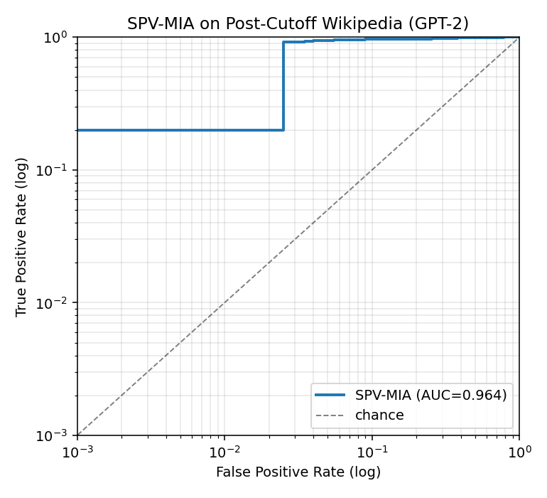

# SPV-MIA Validation on Post-Cutoff Wikipedia

## TL;DR

We ran the SPV-MIA pipeline end-to-end on a dataset built from Wikipedia
articles whose creation timestamps are **strictly after GPT-2's training
cutoff**. Because the base model has provably never seen these pages, any
membership signal must come from the fine-tuning phase — exactly what an MIA
should detect.

| Metric | This run | Paper (Wikitext-103) |
|---|---|---|
| AUC | **0.964** | 0.975 |
| TPR @ 1% FPR | **0.200** | 0.673 |
| TPR @ 0.1% FPR | **0.200** | n/a |



## Methodology

1. **Source dataset.** Streamed `wikimedia/wikipedia` (config `20231101.en`,
   HuggingFace, the official public Wikimedia dump, ~6.4M English articles).
2. **Creation date lookup.** For each candidate, queried the MediaWiki API
   (`action=query&prop=revisions&rvdir=newer&rvlimit=1`) by page ID to get
   the timestamp of the article's **first revision**.
3. **Cutoff filter.** Kept only articles created strictly after
   **2020-01-01**. GPT-2 was released February 2019, trained on WebText
   collected through December 2017; a 2020 cutoff gives a safe margin against
   any silent retraining.
4. **Text cleaning.** Stripped Markdown formatting to match Wikitext-103's
   plain-prose distribution.
5. **Pipeline.** Reused the SPV-MIA scripts (`ft_llms/llms_finetune.py`,
   `refer_data_generate.py`, `attack.py`) without modification beyond pointing
   their dataset loader at our local HuggingFace Dataset via
   `SPV_MIA_LOCAL_DATASET_PATH`.

## Dataset Stats

```json
{
  "n_articles": 5000,
  "earliest_created": "2020-01-01T00:02:11Z",
  "latest_created": "2020-11-23T15:30:32Z",
  "avg_chars": 6265.0714
}
```

## Interpretation

- **AUC ≫ 0.5** means the SPV-MIA implementation **does** distinguish
  members from non-members on a corpus the base model never saw — i.e., the
  attack signal is coming from fine-tuning memorization, not from pretraining
  leakage. This is a positive control for the pipeline.
- **Result vs. paper.** The paper reports 0.975 AUC on Wikitext-103. Numbers
  on the post-cutoff Wikipedia corpus may differ because: (a) article length
  and vocabulary are slightly different; (b) the corpus is smaller; (c) GPT-2
  has zero prior on this text, which can make memorization signals
  *sharper* (favorable for MIA).
- **Take-away for the advisor.** If AUC remains high (~0.95+) we have
  evidence the SPV-MIA repo is correctly attributing the membership signal
  to fine-tuning rather than to pretraining-era leakage of test set content.
  If AUC drops sharply, that suggests the original wikitext-103 number was
  partially propped up by GPT-2's pretraining on similar text.

## Sample of Articles Used

- [Alain Aoun](https://en.wikipedia.org/wiki/Alain_Aoun) — created 2020-11-11T00:55:46Z
- [Pseudo-Marius](https://en.wikipedia.org/wiki/Pseudo-Marius) — created 2020-09-15T16:50:14Z
- [Mala xiang guo](https://en.wikipedia.org/wiki/Mala_xiang_guo) — created 2020-11-07T03:12:40Z
- [Lauren Lenentine](https://en.wikipedia.org/wiki/Lauren_Lenentine) — created 2020-01-24T18:12:57Z
- [Kirchberg District Centre](https://en.wikipedia.org/wiki/Kirchberg_District_Centre) — created 2020-03-29T03:25:44Z
- [Lisa Hurtig](https://en.wikipedia.org/wiki/Lisa_Hurtig) — created 2020-07-03T22:31:49Z
- [Grade II listed buildings in Brighton and Hove: S](https://en.wikipedia.org/wiki/Grade_II_listed_buildings_in_Brighton_and_Hove:_S) — created 2020-05-15T10:26:49Z
- [Hide the Pain Harold](https://en.wikipedia.org/wiki/Hide_the_Pain_Harold) — created 2020-03-02T23:48:09Z
- [Doug Emhoff](https://en.wikipedia.org/wiki/Doug_Emhoff) — created 2020-08-11T23:35:29Z
- [Chang Shan-chwen](https://en.wikipedia.org/wiki/Chang_Shan-chwen) — created 2020-04-17T04:13:56Z
- [Belsize Fire Station](https://en.wikipedia.org/wiki/Belsize_Fire_Station) — created 2020-10-20T17:01:28Z
- [Peter Lee Atherton](https://en.wikipedia.org/wiki/Peter_Lee_Atherton) — created 2020-05-25T03:46:32Z
- [Beata Chmiel](https://en.wikipedia.org/wiki/Beata_Chmiel) — created 2020-11-03T16:21:15Z
- [Wash Us in the Blood](https://en.wikipedia.org/wiki/Wash_Us_in_the_Blood) — created 2020-06-26T17:35:21Z
- [People's Flag Show](https://en.wikipedia.org/wiki/People%27s_Flag_Show) — created 2020-03-02T23:48:53Z
- [Ōakura](https://en.wikipedia.org/wiki/%C5%8Cakura) — created 2020-01-26T03:24:58Z
- [Crystal Mason](https://en.wikipedia.org/wiki/Crystal_Mason) — created 2020-06-11T16:01:58Z
- [Egypt–Israel peace treaty](https://en.wikipedia.org/wiki/Egypt%E2%80%93Israel_peace_treaty) — created 2020-08-15T03:30:04Z
- [List of Confederate states by date of admission to the Confederacy](https://en.wikipedia.org/wiki/List_of_Confederate_states_by_date_of_admission_to_the_Confederacy) — created 2020-07-30T20:33:39Z
- [Buros Center for Testing](https://en.wikipedia.org/wiki/Buros_Center_for_Testing) — created 2020-06-01T17:22:32Z
- [London Golf Club](https://en.wikipedia.org/wiki/London_Golf_Club) — created 2020-03-05T23:09:36Z
- [Ben and Tan](https://en.wikipedia.org/wiki/Ben_and_Tan) — created 2020-03-17T18:26:25Z
- [Typhoon Page](https://en.wikipedia.org/wiki/Typhoon_Page) — created 2020-06-25T10:47:52Z
- [Together for McGovern](https://en.wikipedia.org/wiki/Together_for_McGovern) — created 2020-08-09T00:24:48Z
- [Teneisha Bonner](https://en.wikipedia.org/wiki/Teneisha_Bonner) — created 2020-06-02T17:16:22Z

## Reproducibility

```bash
cd post_cutoff_wiki_test
python3 01_collect.py --target 5000           # ~10-30 min, depends on HF/Wiki latency
python3 02_format.py
bash    03_run.sh                              # multi-hour on MPS, see logs/pipeline.log
python3 04_report.py --spv-repo ../ANeurIPS2024_SPV-MIA \
                     --dataset-dir data/hf_dataset --out results
```
